# 2주차 — 개발환경 구축 & 첫 주행

> 강의자료: `02_개발환경구축_및_첫주행_v3.pptx` 16~56p의 실습 부분입니다. 예시 화면은 Ubuntu 22.04 에서 이 패키지로 찍은 것입니다(WSL2 에서도 같은 화면이 뜹니다).
> 명령어는 이 문서에서 **복사–붙여넣기** 하세요. `>` 는 Windows PowerShell, `$` 는 Ubuntu 터미널입니다.

## 0. 사전 확인

- Windows 10 21H2 이상 또는 Windows 11 (`Win+R` → `winver`)
- 작업 관리자(Ctrl+Shift+Esc) → 성능 → CPU → **가상화: 사용**
  - "사용 안 함"이면 BIOS에서 VT-x(Intel) / SVM(AMD) 활성화 후 진행

## 1. WSL2 + Ubuntu 22.04 설치

PowerShell을 **관리자 권한**으로 실행한 뒤:

```powershell
wsl --install -d Ubuntu-22.04
```

재부팅 → Ubuntu 창이 열리면 사용자 이름/비밀번호 설정 (비밀번호는 화면에 안 보이는 게 정상).

설치 확인:

```powershell
wsl --list --verbose
```

`Ubuntu-22.04`의 VERSION이 **2**여야 합니다. 1이면:

```powershell
wsl --set-version Ubuntu-22.04 2
```

<details>
<summary>오류가 나면 (펼치기)</summary>

| 증상 | 해결 |
|---|---|
| `0x80370102` | BIOS에서 CPU 가상화 활성화 |
| `wsl --install`이 없는 명령 | Windows 업데이트 후 재시도 |
| 커널 관련 오류 | `wsl --update` 후 `wsl --shutdown` |
| 설치가 꼬임 | `wsl --unregister Ubuntu-22.04` 후 처음부터 |

</details>

## 2. 환경 일괄 설치 (권장 경로)

Ubuntu 터미널에서 아래 네 줄이면 **ROS 2 Humble + Gazebo + 실습 도구 전부**가 설치됩니다 (약 15~20분):

```bash
sudo apt update && sudo apt install -y git
git clone https://github.com/DCUSnSLab/automotive-sw-2026.git /tmp/ssc_setup
bash /tmp/ssc_setup/scripts/setup_ros2.sh
source ~/.bashrc
```

> 수동으로 단계별 설치를 하고 싶다면 [부록 A](#부록-a-수동-설치-절차)를 따라가세요. 스크립트와 동일한 절차입니다.

설치 검증 — 터미널 2개를 열고 각각:

```bash
ros2 run demo_nodes_cpp talker
```

```bash
ros2 run demo_nodes_py listener
```

`Hello World: N` 이 오가면 성공. **이 화면을 캡처하세요 (과제 ①)**

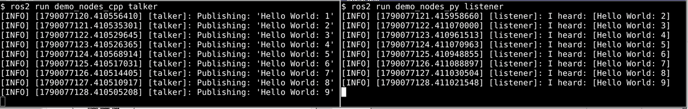

GUI 확인:

```bash
xeyes
```

마우스를 따라오는 눈동자 창이 뜨면 WSLg 정상. (`sudo apt install x11-apps -y` 필요할 수 있음)


## 3. 워크스페이스 구성

```bash
mkdir -p ~/ssc_ws/src && cd ~/ssc_ws/src
git clone https://github.com/DCUSnSLab/automotive-sw-2026.git ssc_class
cd ssc_class && git checkout week-02
cd ~/ssc_ws && colcon build --symlink-install
echo "source ~/ssc_ws/install/setup.bash" >> ~/.bashrc
source ~/.bashrc
```

> `colcon build`가 무엇을 하는지는 3주차에서 배웁니다. 오늘은 따라만 하세요.

빌드가 끝나면 이렇게 나옵니다 (`Summary: 1 package finished`):

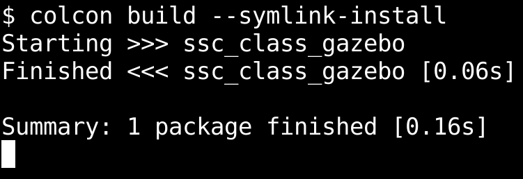

## 4. 첫 주행 — 운전면허 시험장

실습 무대는 운전면허 시험장을 본뜬 171 m × 153 m 코스, 차량은 Ackermann 조향 차량(지붕 2D LiDAR + 전방 카메라)입니다.

<p>
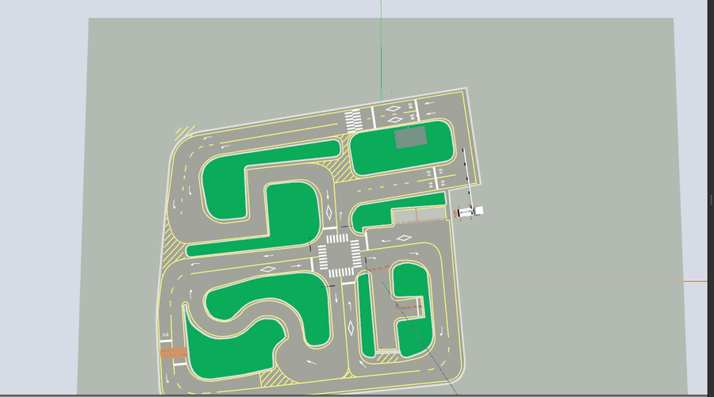
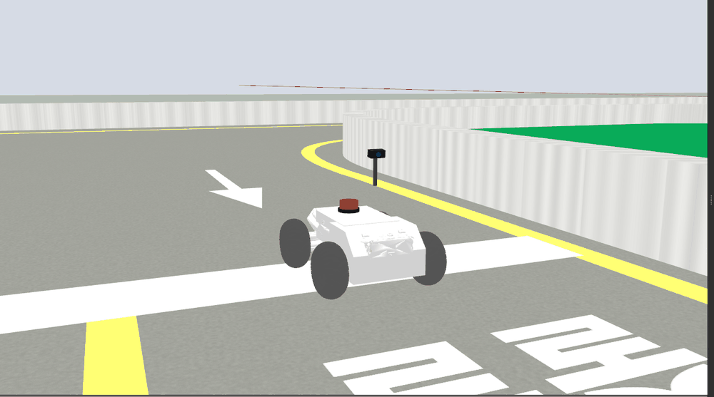
</p>

월드 실행:

```bash
ros2 launch ssc_class_gazebo license_course.launch.py
```

Gazebo 창에 시험장 맵과 차량이 보이면 성공 (출발선 위에서 시작합니다).

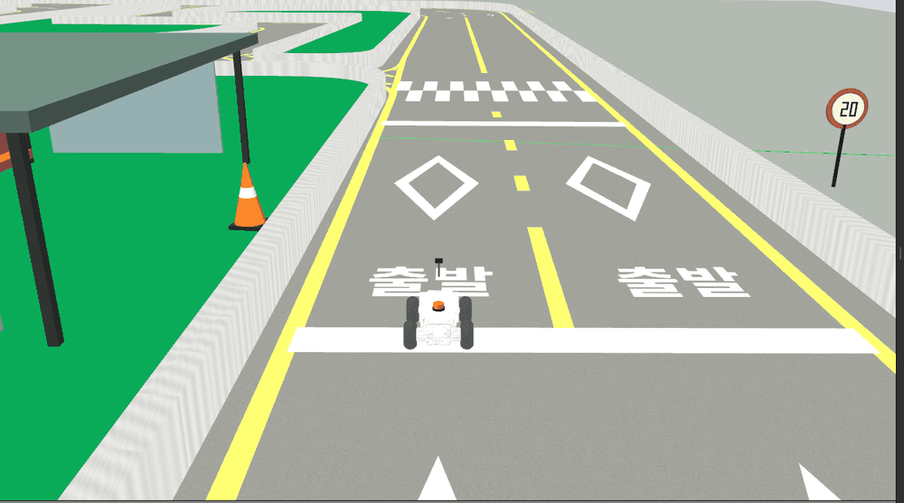

런치 터미널에는 이 줄들이 보여야 합니다:

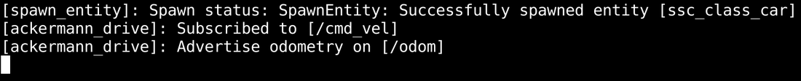

화면이 검거나 Gazebo가 죽으면:

```bash
echo "export LIBGL_ALWAYS_SOFTWARE=1" >> ~/.bashrc && source ~/.bashrc
```

**새 터미널**에서 키보드 조종:

```bash
ros2 run teleop_twist_keyboard teleop_twist_keyboard
```

| 키 | 동작 |
|---|---|
| `i` / `,` | 전진 / 후진 |
| `u` / `o` | 전진하며 좌 / 우 조향 (후진은 `.` / `m`) |
| `j` / `l` | 조향만 좌 / 우 — 앞바퀴만 꺾이고 차는 멈춘다 |
| `k` | 정지 |
| `q` / `z` | 속도·조향 10% 증가 / 감소 (`w`/`x` 는 속도만) |

- `angular.z` 는 회전 속도가 아니라 **조향각**(최대 ±0.461 rad = 26.4°)입니다.
- **키를 떼도 마지막 명령이 유지**됩니다(차가 계속 갑니다). 멈출 땐 반드시 `k`.

<p>
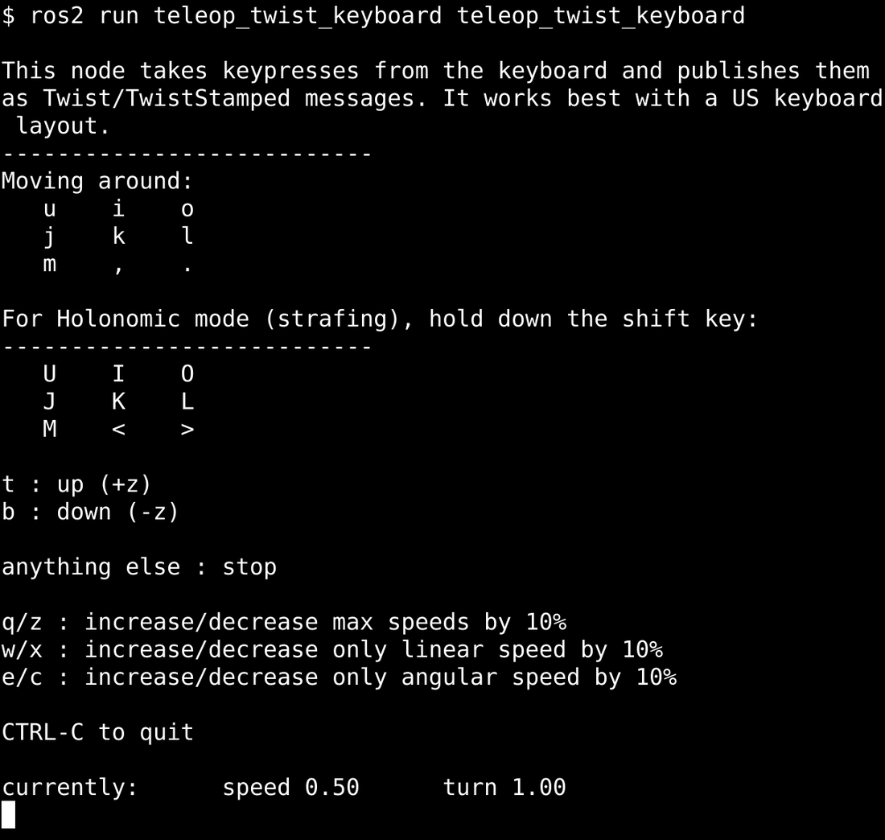
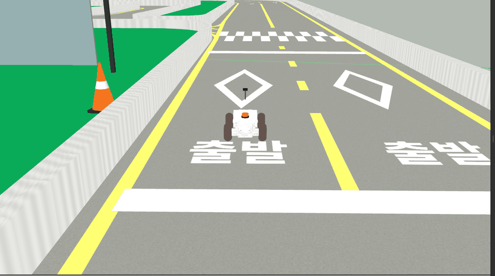
</p>

**미션: 차로를 지키며 코스 한 바퀴 완주.** 완주 화면을 캡처하세요 (과제 ②).

구경하기 — 새 터미널에서:

```bash
rqt_graph                      # 노드-토픽 연결 구조 (/teleop_twist_keyboard → /cmd_vel → /ackermann_drive)
ros2 topic list                # 흐르는 토픽 목록
ros2 topic echo /scan --once   # 라이다 1스캔 (720개 거리값)
ros2 topic hz /odom            # 발행 주기
```

<p>
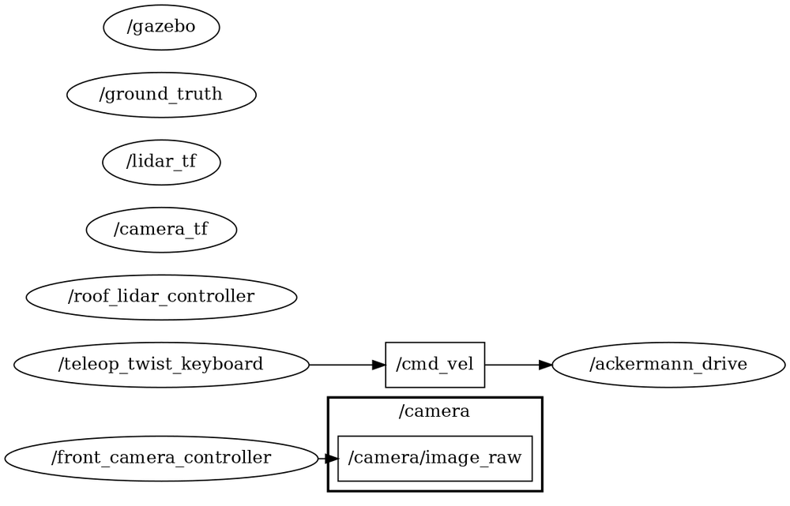
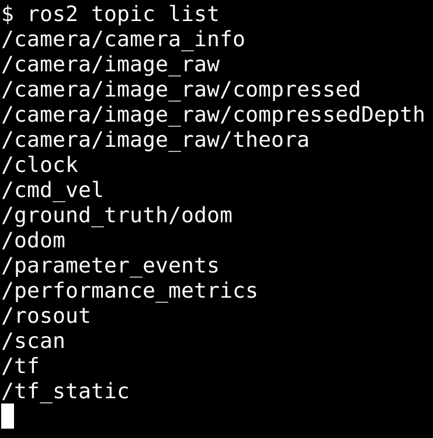
</p>
<p>
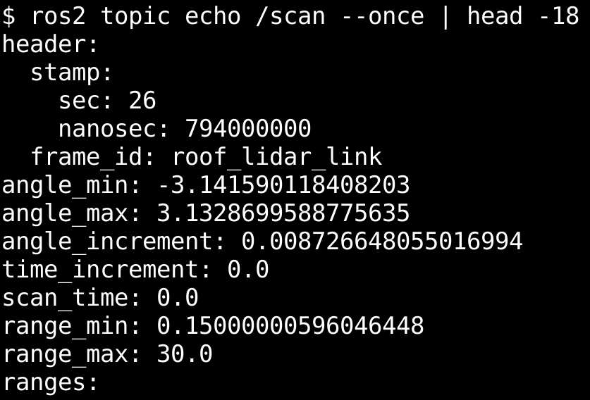
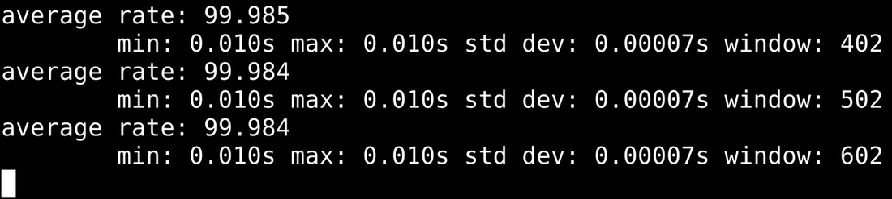
</p>

rqt_graph 에서 `/teleop_twist_keyboard → /cmd_vel → /ackermann_drive` 로 이어지는 그래프를 찾아보세요. `/ackermann_drive` 는 Gazebo 안에서 도는 차량 플러그인 노드입니다.
약 30초 뒤 `Service /spawn_entity unavailable` 이 뜨고 spawn 이 죽으면 Gazebo 가 못 뜬 것 → 부록 B.

### 4-1. 더 들여다보기 (강의자료 50~56p)

```bash
gz camera -c gzclient_camera -f ssc_class_car      # Gazebo 카메라가 차량을 따라감 (차량 우클릭 → Follow 와 같음)
ros2 topic echo /odom --once                        # 주행 후 position.x 가 출발점 약 10.5 에서 줄어든다

# 텔레옵 없이 직접 명령 (전진 + 우조향; 출발선에서 좌조향(+)은 3초 안에 왼쪽 연석에 걸린다)
ros2 topic pub --rate 10 /cmd_vel geometry_msgs/msg/Twist "{linear: {x: 1.0}, angular: {z: -0.3}}"
ros2 topic pub --once /cmd_vel geometry_msgs/msg/Twist "{}"      # 정지
ros2 topic info /cmd_vel                                         # Subscription count: 1

# 센서 보기
ros2 run rqt_image_view rqt_image_view /camera/image_raw
ros2 run rviz2 rviz2 -d $(ros2 pkg prefix ssc_class_gazebo)/share/ssc_class_gazebo/rviz/class_car.rviz
#   (또는 처음부터: ros2 launch ssc_class_gazebo license_course.launch.py rviz:=true)

# 코드로 제어 — 5초 직진 + 3초 우회전 반복, Ctrl+C 로 종료(정지 명령을 보내고 끝남)
cd ~/ssc_ws/src/ssc_class && python3 weeks/week-02/drive_pattern.py
```

<p>
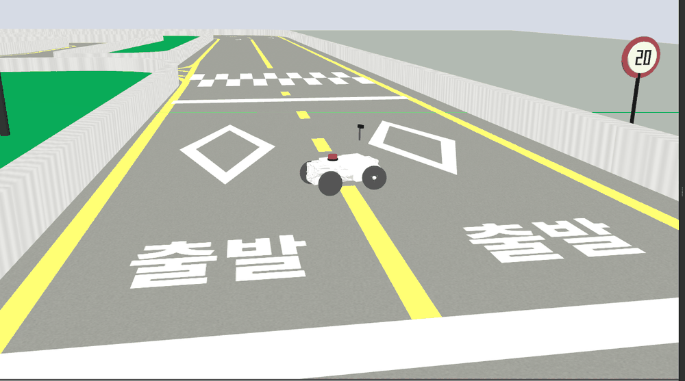
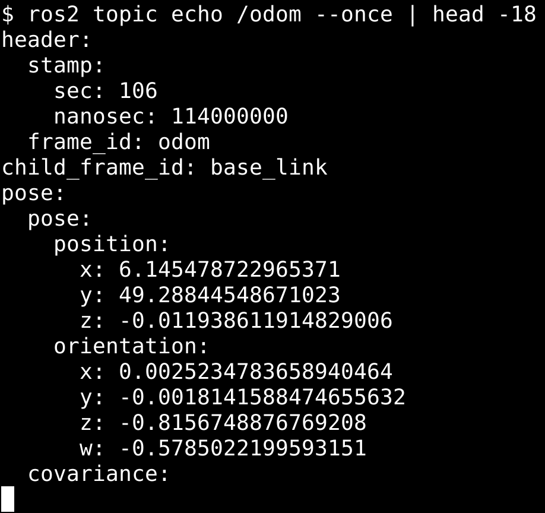
</p>
<p>
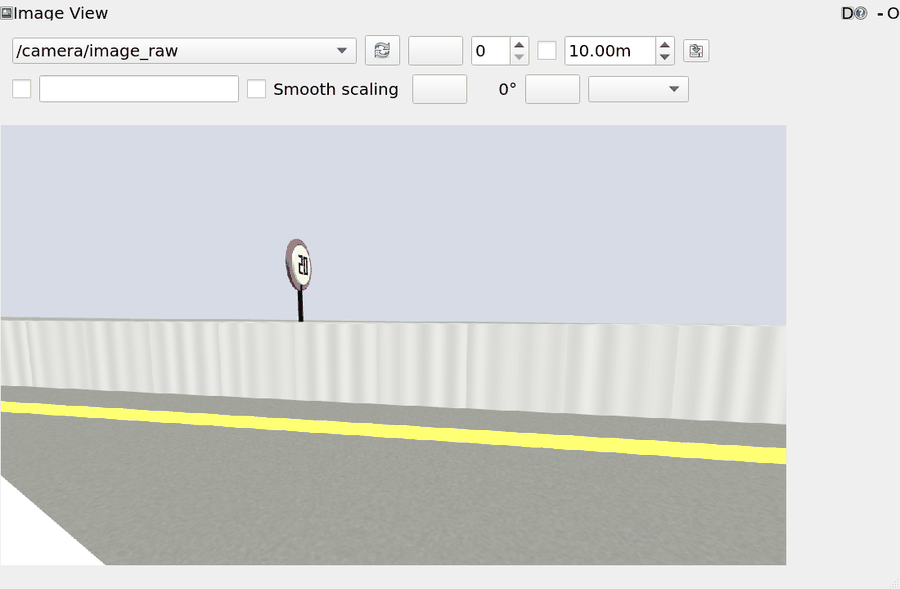
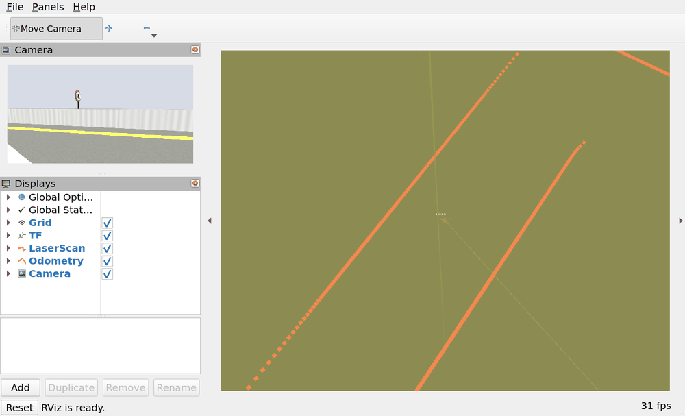
</p>
<p>
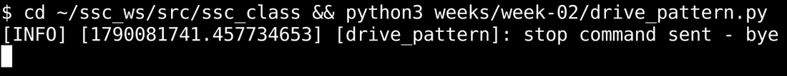
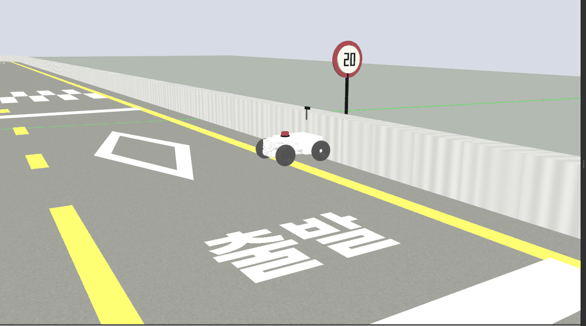
</p>

종료: 텔레옵 터미널 Ctrl+C → 런치 터미널 Ctrl+C. 창이 안 닫히면 `pkill -f gzserver; pkill -f gzclient`, 토픽 목록이 이상하면 `ros2 daemon stop`.

## 5. 과제 (LMS 제출, 다음 수업 전날 23:59)

1. talker / listener 동시 실행 캡처
2. 시험장 코스 완주 스크린샷 (또는 30초 영상)
3. (가산점) 텔레옵으로 주차구역에 차량 넣기
- 환경 구축 실패 시: 오류 화면 + 시도 내용 제출 (감점 없음, 해결 지원)

---

## 부록 A. 수동 설치 절차

`setup_ros2.sh`가 하는 일을 단계별로 직접 실행하는 버전입니다.

### A-1. locale & ROS 2 저장소

```bash
sudo apt update
sudo apt install -y locales software-properties-common curl
sudo locale-gen en_US.UTF-8
sudo add-apt-repository -y universe
sudo curl -sSL https://raw.githubusercontent.com/ros/rosdistro/master/ros.key \
  -o /usr/share/keyrings/ros-archive-keyring.gpg
echo "deb [arch=$(dpkg --print-architecture) signed-by=/usr/share/keyrings/ros-archive-keyring.gpg] http://packages.ros.org/ros2/ubuntu $(. /etc/os-release && echo $UBUNTU_CODENAME) main" \
  | sudo tee /etc/apt/sources.list.d/ros2.list > /dev/null
```

### A-2. ROS 2 Humble + 개발 도구

```bash
sudo apt update
sudo apt install -y ros-humble-desktop ros-dev-tools
echo "source /opt/ros/humble/setup.bash" >> ~/.bashrc
source ~/.bashrc
```

### A-3. Gazebo Classic 11 + 실습 패키지

```bash
sudo apt install -y ros-humble-gazebo-ros-pkgs \
                    ros-humble-teleop-twist-keyboard \
                    ros-humble-ackermann-msgs \
                    terminator git x11-apps
```

### A-4. (선택) 분할 터미널 Terminator

```bash
terminator &
```

`Ctrl+Shift+E` 세로 분할 / `Ctrl+Shift+O` 가로 분할 / `Ctrl+Shift+W` 닫기

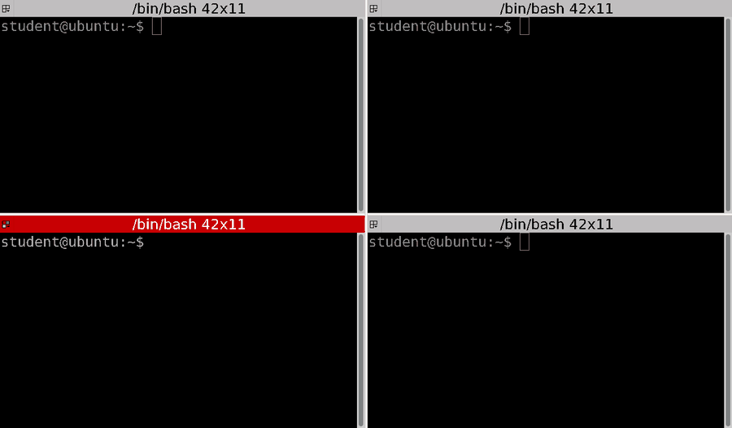

## 부록 B. 자주 발생하는 문제

| 증상 | 해결 |
|---|---|
| apt가 매우 느림 | 네트워크 확인, 또는 미러 변경(`mirror.kakao.com`) |
| Gazebo 검은 화면·충돌 | `LIBGL_ALWAYS_SOFTWARE=1` (§4 참조) |
| GUI 창이 안 열림 | Windows 21H2+ 확인 → `wsl --update` → `wsl --shutdown` 후 재실행 |
| `ros2: command not found` | `source ~/.bashrc` 또는 새 터미널 |
| colcon 빌드 오류 | `cd ~/ssc_ws && rm -rf build install log` 후 재빌드 |
| `Service /spawn_entity unavailable` 뒤 spawn 실패 | 이전 gzserver 잔존 → `pkill -f gzserver` 후 재실행 |
| gzserver 가 exit code -6 으로 죽음 | `source /usr/share/gazebo/setup.sh` 를 `~/.bashrc` 에 추가 (launch 도 보강함) |
| 옆 사람 키보드에 내 차가 움직임 | 같은 네트워크·같은 도메인 → `export ROS_DOMAIN_ID=<내 번호>` `ROS_LOCALHOST_ONLY=1` |
| 키를 눌러도 안 움직임 | 텔레옵 터미널 포커스 확인, `j`/`l` 만 누르면 조향만 됨 → `i`/`u`/`o` |
| 차가 멈추지 않음 | 마지막 `/cmd_vel` 명령 유지 → `k` 또는 `Twist "{}"` 한 번 발행 |
| 첫 월드 로딩이 수 분 | 온라인 모델 DB 조회 → `export GAZEBO_MODEL_DATABASE_URI=""` |
